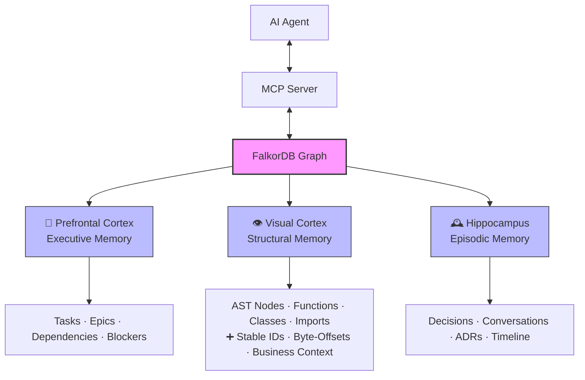

# Deepseekagents-DSA-Context-Engine
The Cognitive Architecture for AI Agents. Infinite Context. Perfect Recall. Zero Hallucinations.

# 🧠 DSA Context Engine

**The Cognitive Architecture for AI Agents.***Infinite Context. Perfect Recall. Zero Hallucinations.*

```
 
[](https://www.npmjs.com/package/dsa-context-engine)
[](https://bun.sh)
[](https://www.falkordb.com)
[](https://modelcontextprotocol.io)
[](LICENSE)
[](https://discord.gg/deepseekagents)
[](mailto:enterprise@deepseekagents.com)
[](https://deepseekagents.com/enterprise)
```

Built by&#x20;**[DeepSeekAgents](https://github.com/deepseekagents)** · **For Agents That Need to Remember**

[📚 Documentation](https://docs.deepseekagents.com) • [⚡ Quick Start](#-quickstart-give-your-agent-a-brain-today) • [🏢 Enterprise](#-dsa-cloud--managed-agentic-memory) • [🌟 Star Us](https://github.com/deepseekagents/dsa-context-engine)

**Give your agent Infinite Context. Perfect Recall. Zero Hallucinations.**

Install DSA for **Claude Code**, **Codex CLI**, **Codex App**, **Factory Droid**, **Gemini CLI**, **OpenCode**, **Cursor**, and **GitHub Copilot CLI**.

```html
</div>
```

```html
<div align="center">
&#x20; <code>bun install -g dsa-context-engine</code> — quick install
</div>
```

> **Stop pasting the same context into Cursor over and over.**&#x47;ive your AI permanent memory—tasks, code structure, and conversations—all in one blazing‑fast graph..

***

## 🚨 The Crisis: Your AI Has No Long-Term Memory

AI coding assistants are stuck in an infinite loop of amnesia. Every conversation starts from zero. Every session forgets yesterday's breakthroughs. Every agent operates in isolation.

**The current landscape is broken:**

| Tool                       | Memory Type        | Problem                                            |
| -------------------------- | ------------------ | -------------------------------------------------- |
| **Cursor / Copilot**       | Vector RAG         | Knows *what* code exists, not *why* it was written |
| **Claude Code / OpenCode** | Session scratchpad | Forgets everything when terminal closes            |
| **LangChain / Mem0**       | Flat chat logs     | No connection to code structure or tasks           |
| **Linear / Jira**          | Task silos         | Agents can't query them programmatically           |

Your agent doesn't need a **larger context window**. It needs a **brain**—a persistent, queryable, interconnected memory system that spans code, tasks, and conversations.

***

## 💡 The Solution: A Tripartite Brain for AI

**DSA Context Engine** is the ultimate **MCP server** for your existing AI tools. It unifies three memory systems into a single, blazing-fast temporal graph (powered by FalkorDB). It runs locally, syncs over Git (or real-time via DSA Cloud), and exposes everything via the Model Context Protocol (MCP).

### 👀 See It In Action

*(Placeholder: Insert a high‑quality GIF showing a split screen – left: developer typing&#x20;**`dsa task create "Fix auth bug"`**&#x20;in terminal; right: Cursor agent instantly referencing the task and the exact function from&#x20;**`auth.ts`**.)*

### ⚡ Token Savings: See the ROI Instantly

| Approach                      | Tokens Consumed | Cost (Claude Opus)    |
| ----------------------------- | --------------- | --------------------- |
| **Standard RAG** (whole file) | \~15,000        | \$0.375               |
| **DSA Byte‑Offset Retrieval** | \~120           | **\$0.003**           |
| **Savings**                   | **\~99% less**  | **\$0.372 per query** |

*Every MCP response includes a&#x20;**`_meta`**&#x20;envelope showing exactly how many tokens and dollars you saved.*

### 🤝 Community & Social Proof

```html
<div align="center">
&#x20; 
&#x20; 
</div>
```

> *"DSA saved me \$40 in Claude API costs this week alone. The token savings meter is pure gold."*— **@indiehacker, beta tester**

> *"We deployed DSA Cloud across our 50‑person engineering team. Agent response times dropped 80% and we finally have a single source of truth."*— **CTO, SaaS company**

### The Triptych Architecture



#### 1. 🎯 **Prefrontal Cortex** (Executive Memory)

An event-sourced, Git-native task manager that replaces scattered todo lists. Tracks epics, tasks, dependencies, and blockers with full temporal history. Your agent knows exactly what to work on and why.

#### 2. 👁️ **Visual Cortex** (Structural Memory)

A real-time, WebAssembly-powered AST listener using [Tree-sitter](https://tree-sitter.github.io/tree-sitter/). It watches your filesystem and maps every class, function, and import directly into the graph. **Unlike brute‑force file dumping, DSA indexes your codebase once and gives agents precision access:**

* **Stable Symbol IDs** like `src/auth.py::AuthService.login#method` – agents can reference the same function forever, even as code changes.
* **Byte‑Offset Retrieval** – fetch only the exact lines of a function (O(1)), not the whole file.
* **Context Providers** – automatically detect tools like dbt, Terraform, OpenAPI and enrich nodes with business metadata (descriptions, tags, column names).
* **Impact‑Aware Code Context** – inspect a symbol's callers, callees, imports, related tasks, and decision history before a change spreads.
* **Git Diff Impact** – map changed symbols to upstream code paths, open tasks, and relevant episodes while the local index reports freshness.
* **Token Savings Meter** – every MCP response reports how many tokens and dollars you saved compared to reading entire files. Cumulative totals let you see your ROI in real time.

All of this is enriched with semantic summaries using an **ultra-cheap LLM waterfall**:

```
Local Ollama (free) → Groq (free tier) → Gemini 2.0 Flash ($0.0001/1K tokens)
```

Cost to index an entire codebase: **<\$0.01**

#### 3. 🕰️ **Hippocampus** (Episodic Memory)

Powered by [Graphiti MCP](https://github.com/getzep/graphiti), this layer ingests every conversation, architectural decision, and commit message. It connects the *Why* (episodic context) to the *What* (code structure) and the *When* (task timeline).

> **Result:** Ask your agent *"Why did we pause the auth refactor?"* and it instantly queries the graph to find the exact task, the modified `auth.ts` file, and the conversation where you decided the API was unstable.

***

## 🚀 Feature Matrix: Built for Every Scale

### For Solo Developers & Power Users

| Feature                         | Benefit                                                             | Tech                        |
| ------------------------------- | ------------------------------------------------------------------- | --------------------------- |
| **Zero-cost semantic indexing** | Index entire codebases for free using local Ollama                  | LiteLLM waterfall           |
| **Instant context loading**     | Agent loads full project memory in <50ms                            | FalkorDB sub‑ms queries     |
| **Real‑time AST updates**       | File saves update graph in <10ms                                    | web-tree-sitter + chokidar  |
| **Token‑efficient retrieval**   | Fetch only the exact function you need – **up to 99% fewer tokens** | Byte‑offset + stable IDs    |
| **Impact-aware changes**        | See callers, callees, tasks, and memories touched by a diff         | AST graph + Git diff        |
| **MCP‑native**                  | Works with any MCP client out of the box                            | stdio + HTTP transports     |
| **100% air‑gapped local mode**  | Your code never leaves your machine                                 | Local FalkorDB + file cache |

### For Distributed Teams (Open Source Git Sync)

| Feature                            | Benefit                                                                                                        | Tech                                    |
| ---------------------------------- | -------------------------------------------------------------------------------------------------------------- | --------------------------------------- |
| **Zero-conflict Git sync**         | Multiple agents edit memory simultaneously without merge conflicts                                             | Append‑only JSONL + custom merge driver |
| **Branch‑aware namespaces**        | Switch Git branches, switch memory contexts automatically                                                      | Graphiti `group_id`                     |
| **Architectural Decision Records** | Auto‑link team conversations to code                                                                           | Episode → AST node edges                |
| **Cypher hyper‑queries**           | Ask questions RAG can't answer: *"Show all open tasks that depend on functions modified in the last 48 hours"* | Native FalkorDB Cypher                  |

### For AI Agent Builders

| Feature                  | Benefit                                                                          | Tech                   |
| ------------------------ | -------------------------------------------------------------------------------- | ---------------------- |
| **Full MCP toolset**     | Call `list_tasks`, `search_memory`, `get_symbol_source` directly from your agent | MCP server             |
| **Blast-radius context** | Check upstream/downstream code impact before changing a symbol                 | Graph traversal        |
| **Freshness warnings**   | Warn the agent when Git checkout or file changes are still re-indexing         | Local proxy + watcher  |
| **Auto‑task unblocking** | AST changes automatically mark dependent tasks as unblocked                      | Graph triggers         |
| **Temporal search**      | Search across time: *"What did we decide about the API last month?"*             | Graphiti hybrid search |
| **Savings meter**        | Every response includes `_meta` with tokens saved and cost avoided               | Built‑in token counter |

***

## ⚡ DSA vs. The Status Quo

| Capability                | DSA Context Engine                 | Cursor / Copilot      | LangChain / Mem0  | Claude Code / OpenCode |
| ------------------------- | ---------------------------------- | --------------------- | ----------------- | ---------------------- |
| **Code structure (AST)**  | ✅ Perfect graph mapping            | ❌ Probabilistic RAG   | ❌ None            | ⚠️ File-level only     |
| **Task management**       | ✅ Native graph DB                  | ❌ None                | ❌ None            | ❌ None                 |
| **Episodic intent (Why)** | ✅ Temporal graph links             | ❌ Forgotten instantly | ⚠️ Flat text logs | ❌ Session-bound        |
| **Multiplayer sync**      | ✅ Git / ☁️ Cloud real‑time         | ❌ Local only          | ⚠️ Cloud API      | ❌ Local only           |
| **Token cost**            | ✅ \~\$0.00 + **up to 99% savings** | ❌ High                | ❌ High            | ❌ High                 |
| **Query complexity**      | ✅ Cypher hyper‑queries             | ❌ Keyword only        | ⚠️ Vector only    | ❌ None                 |
| **Offline capable**       | ✅ Full offline mode                | ⚠️ Requires API       | ❌ Requires API    | ⚠️ Limited             |

***

## ⚡ Quickstart: Give Your Agent a Brain Today

### Prerequisites

* [Bun](https://bun.sh) 1.1.0+
* [Docker](https://docker.com) (for local FalkorDB)

### 1. Install & Initialize

```shellscript
# Install globally
bun install -g dsa-context-engine

# Initialize in your project
cd your-project
dsa init
```

This spins up FalkorDB, creates `.dsa/journal.jsonl`, and starts the AST watcher.

### 2. Connect Your Agent

DSA runs as a local stdio MCP server:

```shellscript
bunx dsa mcp
```

Use the same server command in your coding tool.

**Claude Code**

```shellscript
claude mcp add dsa -- bunx dsa mcp
```

**Codex CLI and Codex App**

Add DSA to Codex with the CLI. The MCP entry is written to the Codex configuration profile used by Codex local surfaces that load `~/.codex/config.toml`.

```shellscript
codex mcp add dsa -- bunx dsa mcp
```

**Factory Droid**

Add DSA to `~/.factory/mcp.json` for personal use or `.factory/mcp.json` for project-shared configuration:

```json
{
  "mcpServers": {
    "dsa": {
      "type": "stdio",
      "command": "bunx",
      "args": ["dsa", "mcp"],
      "disabled": false
    }
  }
}
```

**Gemini CLI**

```shellscript
gemini mcp add dsa bunx dsa mcp
```

**OpenCode**

Add DSA under `mcp` in `opencode.json`:

```json
{
  "$schema": "https://opencode.ai/config.json",
  "mcp": {
    "dsa": {
      "type": "local",
      "command": ["bunx", "dsa", "mcp"],
      "enabled": true
    }
  }
}
```

**Cursor**

Add DSA to `.cursor/mcp.json` for the project or `~/.cursor/mcp.json` globally:

```json
{
  "mcpServers": {
    "dsa": {
      "command": "bunx",
      "args": ["dsa", "mcp"]
    }
  }
}
```

**GitHub Copilot CLI**

Open Copilot CLI and run `/mcp add`, then choose a local stdio server with command `bunx` and arguments `dsa mcp`. To configure it directly, add DSA to `~/.copilot/mcp-config.json`:

```json
{
  "mcpServers": {
    "dsa": {
      "type": "local",
      "command": "bunx",
      "args": ["dsa", "mcp"],
      "tools": ["*"]
    }
  }
}
```

**Any MCP Client**

```shellscript
bunx dsa mcp  # Runs stdio MCP server
```

### 3. See the Magic: Before & After

**Before DSA (Agent has no memory):**

```
User: "What's the status of the auth refactor?"

Agent: "I don't know. Let me search your codebase..."
(Opens auth.ts, scans 500 lines, misses the context)
```

**After DSA (Agent has a brain):**

```
User: "What's the status of the auth refactor?"

Agent: "I see task dsa-a1b2 is blocked because we paused the JWT migration 
        due to API instability (episode from 2 days ago). The relevant function 
        `validate_token()` at auth.ts:45 was last modified by @jane.
        Here's the exact source..."
```

***

## 🛠️ CLI Commands (For Humans)

While agents interact via MCP, humans get a powerful CLI:

```shellscript
# Task management
dsa task create "Migrate auth to JWT"
dsa task block dsa-a1b2 dsa-c3d4
dsa task list --status open
dsa task show dsa-a1b2 --with-context

# AST operations
dsa ast watch           # Start background AST listener
dsa ast find "login()"  # Find code entity (returns stable ID)
dsa get_symbol src/auth.ts::AuthService.login#method  # Fetch exact source
dsa ast status          # Show watcher stats

# Episodic memory
dsa chat "We decided to pause JWT migration due to API instability"
dsa search "why did we pause auth?"

# Distributed sync (open source)
dsa sync                # Git pull + replay + push
dsa branch feature/auth # Switch memory namespace

# DSA Cloud (enterprise)
dsa login --org your-company  # Connect to managed cloud
dsa status              # Show system health
dsa logs                # View daemon logs
```

***

## 🏢 DSA Cloud – Managed Agentic Memory

The open‑source Git protocol is perfect for distributed indie teams. But when you're orchestrating hundreds of developers and thousands of concurrent AI agents, asynchronous Git merges introduce latency. You need **real‑time, centralized truth**.

**DSA Cloud** replaces the local JSONL + Git sync with a fully managed FalkorDB cluster and WebSocket‑based real‑time synchronization. It removes the need for local Docker containers and instantly networks your entire organization's AI swarm.

> **The open‑source engine is free for personal use. DSA Cloud is a commercial product for teams that need real‑time sync and enterprise features.**

### Why Enterprise Teams Choose DSA Cloud

| Capability                        | Benefit                                                                                                                                                        |
| --------------------------------- | -------------------------------------------------------------------------------------------------------------------------------------------------------------- |
| ⚡ **Real‑time WebSocket sync**    | When Agent A unblocks a task or learns a new architectural rule, Agent B knows about it **<10ms later** – anywhere in the world.                               |
| 🐳 **Zero local infrastructure**  | Developers run `dsa login --org your-company` and connect directly to the secure cloud graph. No Docker, no local FalkorDB.                                    |
| 🔐 **Enterprise RBAC & security** | Strict role‑based access control. Isolate memory graphs by team, project, or clearance level. SOC2‑compliant architecture.                                     |
| 🧠 **Infinite scale**             | Managed clusters hold millions of AST nodes and episodic memories without degrading agent prompt latency.                                                      |
| 📊 **Fleet analytics dashboard**  | See exactly what your agents are spending time on, which code paths cause the most confusion, and visualize your entire task dependency graph in your browser. |

### How It Works in 3 Steps

1. **Provision** – Spin up a dedicated DSA Cloud Graph for your organization in one click.
2. **Connect** – Your team runs `dsa login --org your-company`. The local CLI and MCP servers securely route all graph queries to the cloud.
3. **Orchestrate** – Human developers and AI agents instantly share the exact same Prefrontal (Tasks), Visual (Code), and Hippocampus (Episodic) memory in real‑time.

```html
<div align="center">
&#x20; <br/>
&#x20; <h3>Stop managing local graph databases. Start orchestrating agent swarms.</h3>
&#x20; <a href="https://deepseekagents.com/enterprise">
&#x20;   
&#x20; </a>
&#x20; <br/>
&#x20; <sub>Need custom VPC deployment? <a href="mailto:enterprise@deepseekagents.com">Contact our Enterprise Solutions Team →</a></sub>
&#x20; <br/><br/>
</div>
```

***

## 🔬 Technical Architecture (In Brief)

```yaml
Runtime:      Bun (TypeScript) – native speed, single-file executables
Graph DB:     FalkorDB – Redis-backed, sub-millisecond, MCP-native
MCP Server:   Graphiti (FastMCP fork) – stdio + HTTP transports
AST Parser:   web-tree-sitter – WASM, 200+ languages, <5ms per file
LLM Router:   LiteLLM – waterfall: Ollama → Groq → Gemini → fallback
Event Store:  JSONL append-only – Git-friendly, replayable
Persistence:  Docker volumes for FalkorDB + optional Git backup
Cloud Sync:   WebSocket + managed FalkorDB cluster (enterprise)
Token Savings: Built‑in meter with tiktoken, cumulative totals
Stable IDs:   {file_path}::{qualified_name}#{kind}
Context Providers: dbt, Terraform, OpenAPI, docstrings (extensible)
Security:     Local mode is 100% air‑gapped – your code never leaves your machine.
```

[📚 Read the Full Architecture Documentation →](https://docs.deepseekagents.com/architecture)

***


***

## 🤝 Contributing

We welcome contributions from the community. See CONTRIBUTING.md for guidelines.

**Priority areas:**

* Additional Tree‑sitter language grammars
* Custom merge driver improvements
* IDE integrations (Neovim, IntelliJ)
* More LLM provider adapters

***

## 📄 License

DSA Context Engine is **dual‑licensed**:

* **Free for personal/non‑commercial use** – individuals, students, hobbyists, and non‑profits may use the software for free under the terms of the non‑commercial license.
* **Commercial use requires a paid license** – any use by a for‑profit organization, internal business use, or revenue‑generating activity requires a commercial license.

The full source code is available under the non‑commercial license. Commercial licenses are available per‑seat or per‑organization.

**For commercial licensing inquiries, contact:**&#xD83D;� [licensing@deepseekagents.com](mailto:licensing@deepseekagents.com)

*DSA Cloud is a commercial product; the open‑source engine remains under the dual license.*

***

## 💬 Community

* [Discord](https://discord.gg/deepseekagents) – Support and discussion
* [Twitter](https://twitter.com/deepseekagents) – Updates and announcements
* [GitHub Issues](https://github.com/deepseekagents/dsa-context-engine/issues) – Bug reports and feature requests

***

```html
<div align="center">
&#x20; 
**Stop treating agents like interns. Give them a brain.**
```

**[🌟 Star the Repository](https://github.com/deepseekagents/dsa-context-engine)** · **[📚 Read the Docs](https://docs.deepseekagents.com)** · **[💬 Join the Community](https://discord.gg/deepseekagents)**

```html
</div>
```
